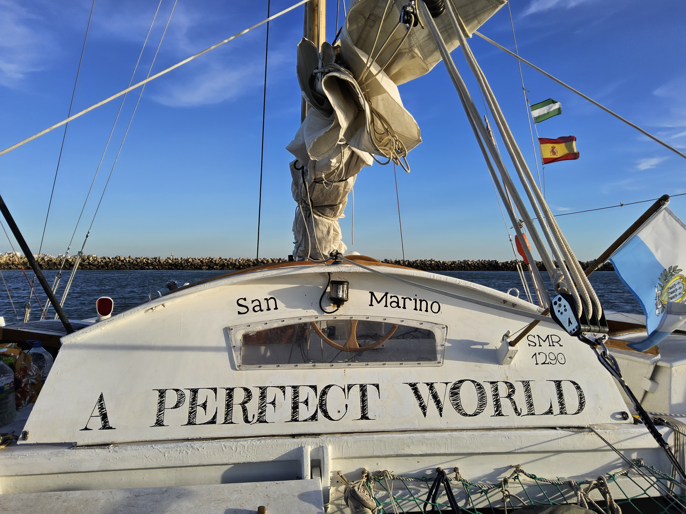

<link rel="preconnect" href="https://fonts.googleapis.com">
<link rel="preconnect" href="https://fonts.gstatic.com" crossorigin>
<link href="https://fonts.googleapis.com/css2?family=Fredericka+the+Great&display=swap" rel="stylesheet">

# Contact

Want to join for a while? Here is the [boat profile](https://www.findacrew.com/boat/378270) on Find A Crew and a [Discussion Group](https://t.me/+yEqiwgHTboAyNTIy) on Telegram;

# Boat

[Photos](https://photos.app.goo.gl/b41YA9pMvp2Wg4u2A) and a poorly maintained [blog](https://t.me/LoveAndLibertyLines_Blog)

# Skipper

[logbook](https://touring-test.github.io/) (major tours only)

Contact to the skipper [on Telegram](t.me/bogoe) or [via email](boran+the+skipper@goegetap.name)

# Background

[Eco Sailboat Transition in 9 Proven Steps](https://www.linkedin.com/posts/boran-goegetap_dear-friends-sailors-or-eco-nerds-here-activity-7394884034369224704-fR-7?utm_source=share&utm_medium=member_desktop&rcm=ACoAAABIgbEBxPqIK7ed2DaRTzVpaJqcn7I13bQ) (post on LinkedIn)

- - -

