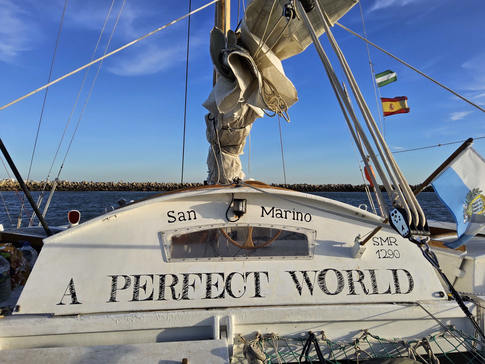

# Get in Touch

Want to join for a while? Here is the [boat profile](https://www.findacrew.com/boat/378270) on Find A Crew and a [Discussion Group](https://t.me/+yEqiwgHTboAyNTIy) on Telegram;

See also our recommended [packing list](crew/packinglist) .

# Skipper

contact Boran [on Telegram](t.me/bogoe) or [via email](mailto:boran@a-perfect.world)

[Logbook](https://touring-test.github.io/) (major tours only)

# Boat

[Photos](https://photos.app.goo.gl/b41YA9pMvp2Wg4u2A) and a poorly maintained [blog](https://t.me/LoveAndLibertyLines_Blog)

[GPS Track / Position](https://share.garmin.com/TouringTest) which is typically up-to-date during passages, via satellite

Inofficial Position
- [Vesselfinder](https://www.vesselfinder.com/vessels/details/211121440) (wrong flag + MMSI, correct name)
- [Marinetraffic](https://www.marinetraffic.com/en/ais/details/ships/shipid:9858754) (wrong flag + MMSI, correct name)

- - -

