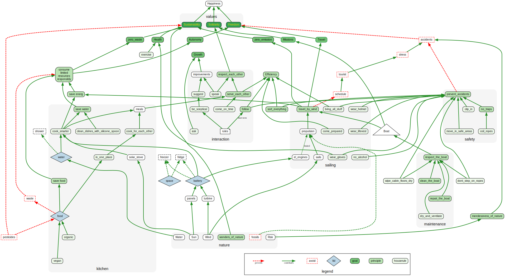

Here you find a logical drilldown from values to goals to principles down to rules.

Please let me explain.

All these value, goals, principles and rules are connected. Every rule has a history or an obvious reason. Every rule supports a principle. Every principle helps to achieve a goal. Every goal supports a value.

This is an attempt of Rule Utilitarianism: to maximize our collective wellbeing and to make sustainable living possible[^1]. The rules may seem strict at first glance, but they're designed to create the predictability, fairness, and resource efficiency that allow us all to thrive together in a challenging environment. 

I recognize that living by explicit rules can feel rigid or unempathetic — but on a boat with limited resources, shared rules actually create more freedom and less conflict than everyone making individual calculations. That said, I encourage critical thinking and actively welcome suggestions for improvement, because the goal isn't rigidity but finding the best guidelines for our shared flourishing.

Where is the fun? Not *in* the rules. The fun is in our individual creativity, be it shared or private, within the limits of our constraints. Accidents at sea are not fun. Scarcity or dependencies are not fun. That's why we try to offload these stress factors, for more fun and happiness on board.





# Principles

*how* we achieve goals - abstract rules

1. we admire the wonders of nature <l abel="sustainable (g)" />

1. we respect the mercilessness of nature, including risks <l abel="Freedom" /> <l abel="safe"/>

1. we improve our skills, so that we can perform our roles together, safely and happily <l abel="Growth" /><l abel="Solidarity" />

1. we create synergy by helping each other <l abel="Solidarity" /><l abel="efficient" />

1. we respect each other -- <l abel="Solidarity" />

1. we respect the boaty <l abel="travel" /><l abel="Freedom" /><l abel="Solidarity" />

1. we repair the boat <l abel="travel" /><l abel="Freedom" /><l abel="Solidarity" />

1. we clean the boat -- <l abel="travel" /><l abel="Freedom" /><l abel="Solidarity" />

1. we travel by wind, not by engine <l abel="sustainable (g)" /><l abel="travel" />

1. we cannot make reliable schedules for passages <l abel="sustainable (g)" /><l abel="travel" />

1. we anchor by default (rarely use marinas) -- <l abel="Autonomy" />

1. we split costs for marinas (after we choose to use one) <l abel="Solidarity" />

1. we split costs for food on board <l abel="Solidarity" />

1. we split costs for operating the boat <l abel="Solidarity" /><l abel="travel" />

1. we seek efficient and safe procedures <l abel="Freedom" />

1. 

we don't create traps <l abel="safe" />
   

   examples: open hatches (in particular the "well"), small or large things in pathways which could be kicked accidentally or cause a person to trip
   

1. we sort everything back into its place after use -- <l abel="safe" /> <l abel="efficient" />

1. we make best use of available space

1. we use water responsibly

1. we use energy responsibly

1. we consume food responsibly and respectfully

1. 

we <i>stock</i> food that is vegan + organic, for everybody...
   <l abel="sustainable (g)" />
   <l abel="healthy" />
   

   
... and we can have fresh food of any diet for current crew on board.

   
Part of that logic is that we rotate stocks. You eat what we bought 2-3 months earlier. So the food stocks shall serve anybody.

   
Plus, unrefridgerated vegan food tends to keep better and causes less food poisoning than animal-based food.

   

1. 
we follow rules until we improve them  <l abel="efficient"/>
   <l abel="safe"/>
   <l abel="Growth"/>
   

1. 

we apply <i>social pricing</i>
   <l abel="Solidarity"/>
   <l abel="sustainable (i)" />
   

   In short: richer people can pay a larger contribution towards the operating cost.
 
   People with less income or savings can benefit from reduced shares in operating costs.

   In theory, social pricing could also fund the food for some crew members. However, I do not like the idea of a crew member who depends 100% on the boat and its social system, for all of their vital needs. They might be motivated or forced to stay with the boat, even if they disagree or otherwise do not enjoy their stay. I want adult crew members with a realistic exit strategy.
   

# House Rules

specific rules and instructions

1. be sceptical and critical about every rule, and follow rules until we negotiate better rules <l abel="safe"/> <l abel="Solidarity"/>

1. speak your mind, challenge any rule and make a better suggestion <l abel="Growth"/>

1. ask questions, and absolutely if you need more information to perform a duty --

1. crew must be able to set sails, lift anchor and climb on board --

1. standard share of operating costs is 10€ per person per day, plus 0.10€ per NM travelled towards an agreed destination (social pricing applies) --

1. no alcohol (or other drugs) during passage or otherwise on (or before) duty

1. be ready to wear lifevest, gloves and helmet

1. 

clip in or move in safe places
   <l abel="safe"/>
   

   
The skipper will show you safe places and clip-in points on deck

1. 

come on time for all appointments
   <l abel="Solidarity"/>
   

   
... most notably for shifts, when the previous watchkeeper and stand-by people and the skipper are counting on a hand-over or briefing with you - and in general, for the respect for each other
 
   

1. 

bring all personal stuff for your shift to the bridge
   <l abel="efficient"/>
   <l abel="safe"/>
   

   
Bring all your personal stuff (life vest, clothes, drinks, snacks...) for your shift to the bridge, where you have it accessible. No visit to your cabin should be necessary during your shift.

   
Having protective gear available at an arm's length is a matter of safety.

   
Avoiding unnecessary trips to the cabin, or asking the stand-by person for assistance, is a matter of efficiency. Of course you must not hesitate to ask for help in any unforseen situation.

1. 

start a shift with all your biological needs already served
   <l abel="efficient"/>
   <l abel="Solidarity"/>
   

   
No breaks for toilet or meals in the galley shall be necessary during a typical 3-hour shift.

   
However, snacking in the helm is OK.

   

1. don't step on ropes

1. coil ropes when not in use --

1. cook recipies that preserve resources (water, energy)

1. cook for each other

1. rotate food stocks (use oldest first)

1. buy only as much as we can consume - avoids food waste

1. buy dry / dehydrated food instead liquid (e.g. dry beans, no liquid soup) - saves weight and space and packaging

1. open only one container max per food type

1. keep and eat food only in the galley or eat on deck

1. no private food stashes

1. no eating in cabins

1. clean dishes immediately

1. clean dishes with help of silicone spoon and hot water --

1. ventilate cabins sufficiently (weather dependent)

1. store mattress vertically while not sleeping (so that it does not rot)

1. wipe cabin walls clean from condensation (remove humidity)

1. wipe cabin floor clean from water (so that we can monitor water intake) --

1. use outdoor toilet at sea, or use WC at land

1. en-suite toilet only for absolute emergencies

1. 

exercise every day...
   <l abel="healthy"/>
   

   
... in some way. This is not about olympic excellence.

   
I suggest that you remain in contact with your body, keep it fit for your role as a sailor, and stay healthy. Hoisting sails, lifting anchor and climbing on board shall not only be possible but be well within your comfort zone.

   
Active sailing counts as exercise. Swimming and cold exposure counts as exercise. Primal movement and contact improvisation count as exercise, for examples.

1. 

medidate, if you have time... 
   <l abel="healthy"/>
   

   
... and meditate even more if you don't have time :-)

## Appendix

Most precious resource on board:

1. **your life**

Most notable limited resources on board:

1. Water
1. Food
1. Energy
1. Space

Negatives, i.e. what we do **not** have on board:

1. no schedule (see wind)
1. no tourists (see schedule)
1. no fridge *(but on wishlist)*
1. no freezer *(wishlist)*
1. no shower
1. no pressurized water
1. no pesticides (per chosen values)
1. no fossil fuels (per chosen values)

- - -

How rules, principles, goals and values are connected:

[^2]

- - - 

2026-01-05 Version 11

- - - 

## References

[^1]: see also [https://en.wikipedia.org/wiki/Rule_utilitarianism](https://en.wikipedia.org/wiki/Rule_utilitarianism)

[^2]: [diagram source](https://observablehq.com/@bogo/a-perfect-world-boat-value-map)
