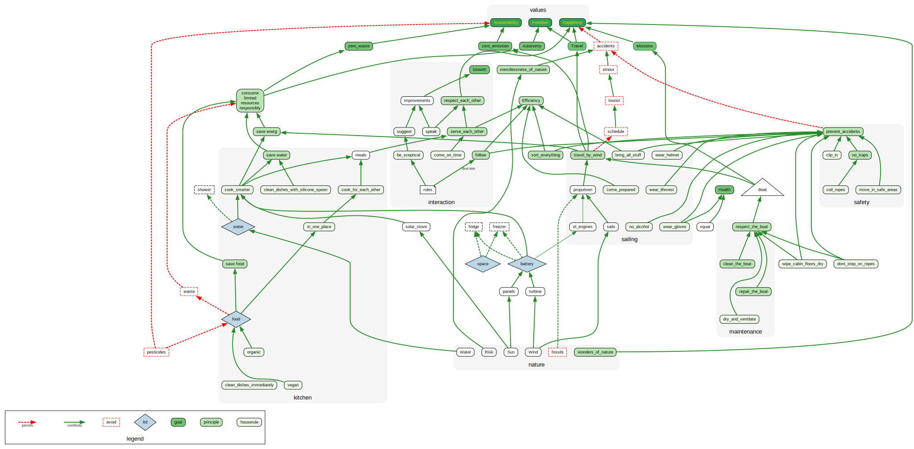

<link rel="preconnect" href="https://fonts.googleapis.com">
<link rel="preconnect" href="https://fonts.gstatic.com" crossorigin>
<link href="https://fonts.googleapis.com/css2?family=Fredericka+the+Great&display=swap" rel="stylesheet">

# Values

*why* we choose this journey
 
1. for Sustainability
1. for Freedom
1. for Happiness

# Goals

*what* we want to achieve or maintain - these are specific and measurable

1. **Growth**: we constantly learn and grow, personally and together
1. Stay in Good **Health**
1. **Zero Emissions**: be it carbon, toxic or otherwise harmful for the environment
1. **Zero Waste**: no wasted food, minimal trash, responsible use of each and any resource
1. **Autonomy**: the boat as a self-sufficient offgrid unit
1. **Travel**: changing location from time to time - not necessarily permanently
1. Go on **Missions**: render humanitarian assistance, as the location and weather allow it

# Principles

*how* we achieve goals - abstract rules

1. we admire the wonders of nature

1. we respect the mercilessness of nature, including risks

1. we improve our skills, so that we can perform our roles safely and happily

1. we create synergy by helping each other

1. we respect each other

1. we respect the boat

1. we repair the boat

1. we clean the boat

1. we travel by wind, not by engine

1. we cannot make reliable schedules for passages

1. we anchor by default (rarery use marinas)

1. we split costs for marinas (if we choose to use them)

1. we split costs for food on board

1. we split costs for operating the boat

1. we apply *social pricing*: richer people can contribute larger amounts

1. we seek efficient and safe procedures

1. we don't create traps

1. we sort everything back into its place after use

1. we make best use of available space

1. we use water responsibly

1. we use energy responsibly

1. we consume food responsibly and respectfully

1. we _stock_ food that is vegan + organic, for everybody (but we can have fresh food of any diet for current crew on board)

1. we follow rules until we improve them

# House Rules

specific rules and instructions

1. be sceptical and critical about every rule, and follow rules until we negotiate better rules

1. speak your mind, challenge any rule and make a better suggestion

1. crew must be able to set sails, lift anchor and climb on board

1. standard share of operating costs is 10€ per person per day, plus 0.10€ per NM travelled towards an agreed destination

1. no alcohol (or other drugs) during passage or otherwise on (or before) duty

1. be ready to wear lifevest, gloves and helmet

1. clip in or move in safe places

1. exercise every day

1. medidate, if you have time

1. come on time for all appointments (shifts...)

1. bring all your personal stuff (life vest, clothes, snacks...) for your shift to the bridge (no visit to cabin should be necessary)

1. start a shift with all your biological needs already served (no breaks for toilet or food shall be necessary, however snacking is OK)

1. don't step on ropes

1. coil ropes when not in use

1. cook recipies that preserve resources (water, energy)

1. cook for each other

1. rotate food stocks (use oldest first)

1. buy only as much as we can consume - avoids food waste

1. buy dry / dehydrated food instead liquid (e.g. dry beans, no liquid soup) - saves weight and space and packaging

1. open only one container max per food type

1. keep and eat food only in the galley or eat on deck

1. no private food stashes

1. no eating in cabins

1. clean dishes immediately

1. clean dishes with help of silicone spoon and hot water

1. ventilate cabins sufficiently (weather dependent)

1. store mattress vertically while not sleeping (so that it does not rot)

1. wipe cabin walls clean from condensation (remove humidity)

1. wipe cabin floor clean from water (so that we can monitor water intake)

1. use outdoor toilet at sea, or use WC at land

1. en-suite toilet only for absolute emergencies

## Appendix

Most precious resource on board:

1. **your life**

Most notable limited resources on board:

1. Water
1. Food
1. Energy
1. Space

Negatives, i.e. what we do **not** have on board:

1. no schedule (see wind)
1. no tourists (see schedule)
1. no fridge *(but on wishlist)*
1. no freezer *(wishlist)*
1. no shower
1. no pressurized water
1. no pesticides (per chosen values)
1. no fossil fuels (per chosen values)

How rules, principles, goals and values are connected:

[diagram source](https://observablehq.com/@bogo/a-perfect-world-boat-value-map)

- - - 

2026-01-01 Version 10
