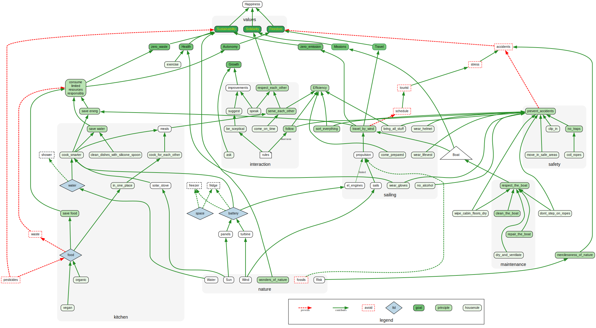

Here you find a logical drilldown from values to goals to principles down to rules.

Please let me explain <i>(click here)</i>.

All these value, goals, principles and rules are connected. Every rule has a history or an obvious reason. Every rule supports a principle. Every principle helps to achieve a goal. Every goal supports a value.

These rules are designed to maximize collective wellbeing, safety and sustainability. They may seem strict at first glance, but they're designed to create the predictability, fairness, and resource efficiency that allow us all to thrive together in a challenging environment. 

Our decision-making model follows a clear distinction: We use consent for all non-safety decisions (like destination planning or daily routines). In safety-critical moments, the skipper[^skipper] has final authority. This ensures that "every
voice matters" doesn't compromise "everyone stays safe."

I recognize that living by explicit rules can feel rigid or unempathetic — but on a boat with limited resources, shared rules actually create more freedom and less conflict than everyone making individual calculations. That said, I encourage critical thinking and actively welcome suggestions for improvement, because the goal isn't rigidity but finding the best guidelines for our shared flourishing.





# Principles

*how* we achieve goals - abstract rules

1. we admire the wonders of nature <l abel="sustainable (g)" />

   Admiration and deepest respect for nature is the ultimate reason for our sustainable life.

   If you want a reason for it. You can also live in sustainable ways, intuitively.

1. we respect the mercilessness of nature <l abel="free" /> <l abel="safe"/>

   We are fully aware of nature's supreme power.

   Taking informed risks enables our freedom of movement.

   Moving respectfully keeps us safe.

1. we respect each other <l abel="Solidarity" />

1. we create synergy by helping each other <l abel="Solidarity" /><l abel="efficient" />

1. we improve our skills <l abel="Growth" /><l abel="Solidarity" />

   ... so that we can perform our roles together, safely and happily.

   Learning and improving skills means personal growth for each crew member.

   Performing a greater set of roles supports the rest of the crew and the wider global community.

1. we act as an active part of the maritime safety net <l abel="Solidarity" />

   We keep ourselves and the boat prepared for spontaneous Search and Rescue (SAR) operations, following standards and best practices by the International Maritime Organization (IMO), other Intergovernmental (IGO) and Nongovernmental (NGO) rescue organizations.

1. we respect the boat 

1. we repair the boat <l abel="sustainable (b)" />

   There is always something to repair or to improve on the boat.

   Every member of the crew contributes some working time into these tasks, while we are not sailing.

1. we clean the boat

   -- like above --

1. we travel by wind, not by engine <l abel="sustainable (+)" /><l abel="travel" />

   The small electric engines are good for anchor- and harbour manoeuvres, and not sufficient for serious travel (not for opposing strong wind or current).

   This is the trade-off for Zero Emissions. Actually larger engines and batteries are quite feasible, but these are not exactly sustainable either.

1. we cannot make reliable schedules for passages

   see before: our passages totally depend on wind, which is not predictable

1. we anchor by default <l abel="Autonomy" />

   We rarely use marinas and anchor instead ... just because we can :-)

   Also it saves operating costs.

1. we split costs for marinas <l abel="Solidarity" />

   Should we choose to use a harbour for convenience or as shelter in hard weather, we split the costs. 

   The crew may choose a harbour based on consent.

   The skipper may choose a harbour for safety.

1. we split costs for food on board <l abel="Solidarity" /> <l abel="Autonomy">

   The boat carries food stocks for many weeks, which we rotate (consume in sequence of "best-before-date") and re-supply.

   We estimate the price of consumed food, e.g. **15 € / person / day** (basic, mostly vegan + organic).

1. we split costs for operating the boat <l abel="Solidarity" /><l abel="travel" />

   The standard share of operating costs is **30 € / person / day**.

   External costs e.g. for marinas or other admissions on top. Normally there are no external costs.

   Social pricing applies.

1. we seek efficient and safe procedures 

   We constantly improve our ways of doing things, so that they are safer or faster or more fun than yesterday.

1. we don't create traps <l abel="safe" />  

   examples: open hatches (in particular the "well"), small or large things in pathways which could be kicked accidentally or cause a person to trip; things that could fall into the water

1. we sort everything back into its place <l abel="safe" /> <l abel="efficient" />

1. we make best use of available space

1. we use water responsibly <l abel="sustainable (+)" />

   We save water in our tanks and, at the same time, for the planet.

1. we use energy responsibly <l abel="Autonomy" />

   Electric energy on board is limited by the capacity of our batteries and the daily harvest.

   2 hours of baking crepes consumes the equivalent of 50 NM travelled by engine. When batteries are full, we can cook like nobody's watching.

1. we source and consume food responsibly <l abel="sustainable (+)" />

1. we *stock* food that is vegan + organic <l abel="sustainable (g)" /> <l abel="healthy" />

   ... and we can have fresh food of any diet for current crew on board.

   Part of that logic is that we rotate stocks. You eat what we bought months earlier. So the food stocks shall serve anybody.

   Plus, unrefrigerated vegan food keeps better and causes less food poisoning than animal-based food.

1. we follow rules until we improve them <l abel="efficient"/> <l abel="safe"/> <l abel="Growth"/>

   We hold review meetings regularly, and we try to identify friction and tension. *"What was good? What needs to be improved?"* are the typical questions to ask. Then we implement changes.

   Until that time: just follow the established rules.

1. we apply *social pricing* <l abel="Solidarity"/> <l abel="sustainable (i)" />

   In short: richer people can pay a larger contribution towards the operating cost.
 
   People with less income or savings can benefit from reduced shares in operating costs.

   In theory, social pricing could also fund the food for some crew members. However, full financial dependence on the boat risks trapping someone aboard even if they'd rather leave — every crew member should have a realistic exit option.

# House Rules

specific rules and instructions

1. be sceptical long-term, and follow rules short-term <l abel="safe"/> <l abel="Solidarity"/>

   Be sceptical and critical about every rule. We can discuss when we have time and capacity to think about them (see following rule).

   Until such time, follow the existing rules on the boat. They are proven and safe.

1. speak your mind, challenge any rule and make a better suggestion <l abel="Growth"/>

   I do not claim to be always right. Everything can be improved. I am genuinely happy to receive feedback and suggestions for improvement.

   The existing rules reflect my accumulated experience in this system of people, values and goals.

   Please offer better versions.

1. ask questions <l abel="safe"/> <l abel="Growth"/>

   Ask questions any time, and absolutely if you need more information to perform a duty.

   In particular, always contact the skipper if something unusual happens during your watch.

1. we plan for refugee routes <l abel="Solidarity" /> <l abel="safe" />

   During passage planning, we research known refugee routes to maximize our chance of being in a position to provide assistance.

1. we stop for distress <l abel="Solidarity" /> <l abel="safe" />

   We stop for any vessel or person in distress. 

   As a minimum, we remain on scene to provide communication and coordination with MRCC and nearby ships, in case where intervention is beyond our capacity in a given situation.

1. we stop for drifting garbage <l abel="sustainable (g)" /> <l abel="safe" />

   We treat its recovery as a Person-Over-Board (MOB) exercise to keep our rescue skills sharp (and the ocean clean).

1. crew must be able to set sails, lift anchor and climb on board <l abel="safe"/>

   Just 3 examples for physical fitness, and probably representative enough for all the other tasks on board.

   Every crew member should be skilled like a solo sailor on this boat, even when we sail as a larger crew.

   Setting sails and lifting anchor: obviously necessary to get the boat moving. 
   
   While the skipper carries final accountability, this is not a crewed charter. We share all responsibilities.

1. come on time for all appointments <l abel="Respect"/>

   Most notably for shifts, when the previous watchkeeper and stand-by people and the skipper are counting on a hand-over or briefing with you - and in general, for the respect for each other 

1. no alcohol during passage <l abel="safe"/>

   No alcohol during passage or other duties (e.g. anchor watch). Also not in "off shifts": there is not enough time to fully recover before your next shift.

   Same applies to other drugs.

1. clip in or move in safe places <l abel="safe"/>

   The skipper will show you safe places and clip-in points on deck.

1. be ready to wear lifevest, gloves and helmet <l abel="safe"/>

   Personal protective gear must be accessible at any time (if not already wearing it).

   The boat has life vests for each crew member, and 2 helmets (which we can share between watchkeepers and oncall person).

   Your life vest must be either on the bridge (watchkeeper) or in the same cabin with you. Situations at sea can change quickly, so we should not count on an extra trip to another cabin in an urgent situation.

1. bring all personal stuff for your shift to the bridge <l abel="efficient"/> <l abel="safe"/>

   Besides protective gear (previous rule): bring all your personal stuff (extra clothes, raingear, boots, drinks, snacks, camera...) for your shift to the bridge, where you have it accessible. No visit to your cabin should be necessary during your shift.

   Avoiding unnecessary trips to the cabin, or asking the stand-by person for assistance, is a matter of efficiency.

1. start a shift with all your biological needs already served <l abel="efficient"/> <l abel="Solidarity"/>

   No time for a wake-up coffe, meal in the galley, or toilet break shall be necessary during a typical 3-hour shift.

   Snacking at the helm is OK.

   When there is time, and the on-call person is awake, they will be happy to serve a hot drink for the helmsperson.

1. don't step on ropes <l abel="respect the boat" /> <l abel="safe" />

1. coil ropes immediately <l abel="efficient" /> <l abel="safe" /> <l abel="sort things" />

   Typical candidates are halyards after hoisting sails. Also other long ropes such as rolling reef line or sheet must be coiled unless we expect to use them again immediately.

1. cook recipes that preserve resources (water, energy) <l abel="sustainable (+)" />

   We have some unusual ways of cooking or preparing meals on board. The induction stove is one of the more conventional ones and draws a lot of energy, which is OK for short periods of time.

   For longer periods of cooking, we either use a solar stove, or fusion stove on 12V, or the insulated pot.

   We don't cook paste in the classic way where liters of hot water go down the drain.

   For boiling water we use immersion heaters and keep the hot water in thermos bottles (either one-pot pasta with no wasted water, or rice instead).

   Most energy-efficient methods take a bit longer, require a bit more planning in advance, and perhaps require a change of habits.

1. cook for each other <l abel="Synergy" /> <l abel="Solidarity" />

   Sharing meals is efficient and can be fun.

   Everybody who prepares food must consider the whole crew.

   For example when sailing in a crew of 3, the (temporary) cook shall aim at the end of a shift for the meal to be ready. This way, the previous off-shift person can enjoy the meal before their start of shift, and the previous helmsperson can eat immediately after their shift. Obviously this must be coordinated at least one shift in advance, so plan ahead.

   Whoever takes the last hot water must boil more hot water.

1. rotate food stocks <l abel="zero food waste" />

   Typically the boat carries a few weeks worth of food stocks - not only the bag of most recent groceries.

   Use shortest best-before-date first, or use 'package-free' food before opening sealed containers. This requires knowing and checking the existing stock of food. If in doubt, ask whether we have more food of this type.

1. only one open container per food type <l abel="zero food waste" />

   Open only one container per food type, at any time.

   Check the galley before opening a new container.

1. buy only as much as we can consume  <l abel="zero food waste" />

   Be realistic how much fresh food (vegetables or refrigerated food) we can consume with certainty. 

   It can be confusing to buy dried food for many weeks, and limit the fresh products to a few days of consumption.

1. 
buy dry / dehydrated food <l abel="sustainable (+)" /> 

   Buy dry / dehydrated food instead of equivalent liquid ones. Examples: chickpeas, lentils, beans can be easily soaked over night.

   This saves weight and space and packaging, and allows us to store more calories at the same weight.

1. store food in the galley <l abel="one open container"/> <l abel="rotate stocks"/> <l abel="sustainable (b)" />

   No private food stashes.

   We share everything on the boat. Food is no exception.

   Keeping the logistics of food central in the galley helps maintain an overview of existing supplies and the rate of consumption, so that we can predict how long supplies will last and keep the shopping list up to date.

   If you want to make sure that you have enough of your favourite food, then let's discuss capacities together and buy enough.

1. eat in the galley or in safe areas on deck <l abel="respect the boat"/> <l abel="one open container"/>

   No eating in cabins.

   Shared cooking and shared meals — once a day or integrated into the shift schedule — are a chance for a social come-together.

   It also prevents mess from spreading to sleeping areas.

1. clean dishes immediately <l abel="sort things"/>

   The galley shall be ready for preparing drinks or meals at any time. There is not enough space for used plus new dishes.

1. clean dishes with help of silicone spoon and hot water <l abel="sustainable (+)" />

   You will be surprised how little food remains on plates, pots or pans after wiping them with a silicone spoon.

   This has two positive effects at the same time: wasting less food, and simpler cleaning procedure. Actually we never have to fill the whole sink with soapy water.

   Saving the extra spoonful of food is not so much about the absolute mass. We could probably afford the waste. It is about the mindfulness towards precious resources.

1. ventilate cabins sufficiently <l abel="respect the boat"/>

   Depending on the climate, there will be condensation in the cabins. Ventilate accordingly.

1. wipe cabin walls clean from condensation <l abel="respect the boat"/>

   See above -- remove all condensating humidity.

1. store mattress vertically <l abel="respect the boat"/>

   Keep mattresses vertically during the day, so that they can ventilate.

1. wipe cabin floor clean from water <l abel="respect the boat"/>

   This serves boat maintenance, safety and so that we can monitor water intake from waves, rain or leaks.

1. use outdoor toilet at sea, or use WC at land <l abel="zero waste"/> <l abel="respect"/>

   We don't pollute beaches or bays.

   The inside toilet is only for absolute emergencies. Carrying sewage on the boat affects air quality and comfort for everyone on board, in particular inside the double cabin.

1. 
exercise every day...         <l abel="healthy"/> 
 

   ... in some way. This is not about olympic excellence.

   I suggest that you remain in contact with your body, keep it fit for your role as a sailor, and stay healthy. Hoisting sails, lifting anchor and climbing on board shall not only be possible but be well within your comfort zone.

   Active sailing counts as exercise. Swimming and cold exposure counts as exercise. Primal movement and contact improvisation count as exercise, for examples.

1. 
meditate, if you have time... <l abel="healthy"/> 
 

   ... and meditate even more if you don't have time :-)

## Appendix

Negatives, i.e. what we do **not** have on board:

1. no schedule (see wind)
1. no tourists (see schedule)
1. no fridge
1. no freezer
1. no shower
1. no pressurized water
1. no pesticides
1. no diesel or other fossil fuels
1. no excuses

Most notable limited resources on board:

1. Water
1. Food
1. Energy
1. Space

Most precious resource on board:

+ **your life**

- - -

Please note that this system of rules is designed for life at sea. While moored, stress and risks are lower and we have more time available. Some rules might not be as relevant while moored, compared to sailing. Keeping the same standard rules for every situation is simple and safe. While being moored, we have more tolerance and capacity for adaptions.

- - -

Where is the fun? Not *in* the rules. The fun is in our individual creativity, be it shared or private, within the limits of our constraints. Accidents at sea are not fun. Scarcity or dependencies are not fun. That's why we try to offload these stress factors, for more fun and happiness on board.

- - -

How rules, principles, goals and values are connected:

[^2]

- - - 

2026-01-14 Version 14

- - - 

## References

[^skipper]: **skipper** is a role, not a person

[^2]: [diagram source](https://observablehq.com/@bogo/a-perfect-world-boat-value-map)

